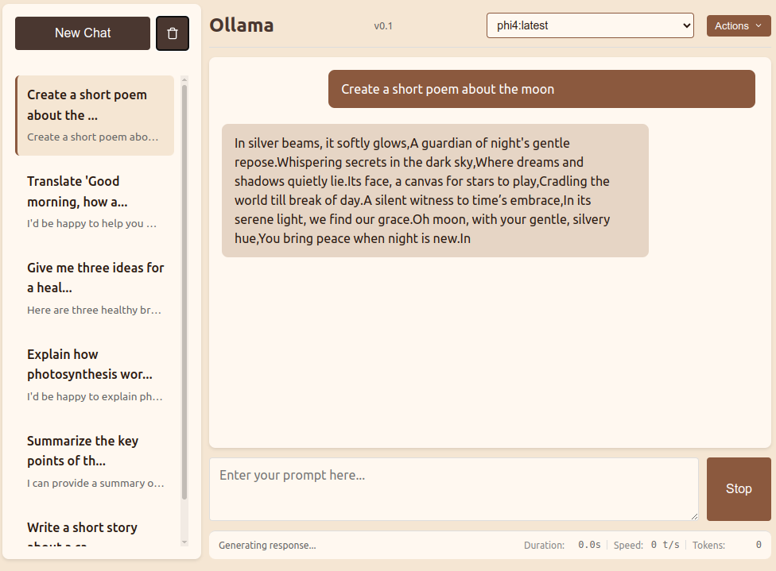

# Ollama Coffee GUI

A lightweight, efficient web-based GUI for interacting with Ollama models. Designed for speed and simplicity, it provides all essential chat functionality in a fast, resource-efficient package that runs directly in your browser.

## Features

- **Interactive Chat Interface**
  - Real-time response streaming
  - Support for multiple Ollama models
  - Message editing and deletion
  - Performance metrics tracking (duration, speed, token count)

- **Chat Management**
  - Multiple chat sessions
  - Chat history persistence
  - Import/export functionality
  - Automatic cleanup of old chats (30 days)

- **User Interface**
  - Multiple themes (Light, Coffee, Dark)
  - Responsive design
  - Intuitive chat organization
  - Model selection dropdown

## Requirements

- A running Ollama instance with models installed
- Python 3 for the local server
- Web browser with JavaScript enabled
- Local storage access for chat persistence

## Installation & Setup

1. Ensure Ollama is installed and running on your system
2. Clone this repository
3. Navigate to the project directory in your terminal
4. Run `python3 -m http.server`
5. Open your browser and navigate to `http://localhost:8000`
6. Select your preferred model from the dropdown

The application will automatically connect to Ollama's API at `http://localhost:11434/api`.

## Usage

### Basic Chat
1. Select a model from the dropdown menu
2. Type your prompt in the input area
3. Press Enter or click Send to start the conversation
4. Use the "New Chat" button to start a fresh conversation

### Chat Management
- **New Chat**: Click the "New Chat" button
- **Delete Chats**: Click the trash icon and select chats to remove
- **Switch Chats**: Click on any chat in the sidebar

### Import/Export
1. Click the "Actions" dropdown
2. Choose "Export Chat History" to save your chats
3. Choose "Import Chat History" to restore previously exported chats

### Theme Switching
1. Click the "Actions" dropdown
2. Select "Switch Theme" to cycle through available themes

## Version

Current version: 0.1

## License

This project is licensed under the Apache License 2.0 - see the [LICENSE](LICENSE) file for details.

## Contributing

Contributions are welcome! Please feel free to submit pull requests.
